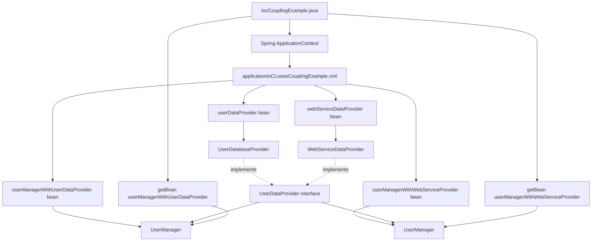

# IoC Coupling Architecture Notes

## What This Example Is Trying to Achieve

This example shows how Spring IoC removes the responsibility of manually creating and connecting objects from our Java code.

Without Spring, the application code decides which object to create:

```java
UserDataProvider databaseProvider = new UserDatabaseProvider();
UserManager userManager = new UserManager(databaseProvider);
System.out.println(userManager.getUserInfo());
```

With Spring IoC, the XML file decides which objects are created and how they are connected:

```xml
<bean id="userManagerWithUserDataProvider" class="com.ioc.coupling.UserManager">
    <constructor-arg ref="userDataProvider"/>
</bean>
```

Then Java only asks Spring for the final ready-to-use object:

```java
UserManager userManagerwithDB =
        (UserManager) applicationContext.getBean("userManagerWithUserDataProvider");
```

The main goal is:

Instead of `IocCouplingExample` creating `UserDatabaseProvider`, `WebServiceDataProvider`, and `UserManager` manually, Spring creates and connects them using configuration.

## Project Structure for IoC Coupling

The IoC coupling example is inside:

```text
src/main/java/com/ioc/coupling
```

Files:

```text
com.ioc.coupling
├── IocCouplingExample.java
├── UserManager.java
├── UserDataProvider.java
├── UserDatabaseProvider.java
└── WebServiceDataProvider.java
```

Spring XML configuration:

```text
src/main/resources/applicationIoCLooseCouplingExample.xml
```

## Responsibility of Each File

### `UserDataProvider.java`

This is an interface.

```java
public interface UserDataProvider {
    String getUserDetails();
}
```

It defines a rule:

Any class that wants to act as a user data provider must have a `getUserDetails()` method.

This interface is the abstraction. `UserManager` depends on this interface instead of depending directly on `UserDatabaseProvider` or `WebServiceDataProvider`.

That is the key to loose coupling.

### `UserDatabaseProvider.java`

This is one implementation of `UserDataProvider`.

```java
public class UserDatabaseProvider implements UserDataProvider {

    @Override
    public String getUserDetails() {
        return "User Details from the Database";
    }
}
```

Its job is to return user details from the database source.

In this learning example, it simply returns a string:

```text
User Details from the Database
```

### `WebServiceDataProvider.java`

This is another implementation of `UserDataProvider`.

```java
public class WebServiceDataProvider implements UserDataProvider {

    @Override
    public String getUserDetails() {
        return "User Details from the Web Service";
    }
}
```

Its job is to return user details from a web service source.

In this learning example, it simply returns:

```text
User Details from the Web Service
```

### `UserManager.java`

This class uses a `UserDataProvider`.

```java
public class UserManager {

    private UserDataProvider userDataProvider;

    public UserManager(UserDataProvider userDataProvider) {
        this.userDataProvider = userDataProvider;
    }

    public String getUserInfo(){
        return userDataProvider.getUserDetails();
    }
}
```

Important point:

`UserManager` does not know whether the data is coming from a database or a web service.

It only knows this:

```java
UserDataProvider userDataProvider;
```

So `UserManager` can work with any class that implements `UserDataProvider`.

This is loose coupling.

### `IocCouplingExample.java`

This is the main class.

```java
ApplicationContext applicationContext =
        new ClassPathXmlApplicationContext("applicationIoCLooseCouplingExample.xml");
```

This line starts the Spring container and loads the XML file.

Then the code asks Spring for a ready `UserManager` object:

```java
UserManager userManagerwithDB =
        (UserManager) applicationContext.getBean("userManagerWithUserDataProvider");
System.out.println(userManagerwithDB.getUserInfo());
```

This gets a `UserManager` connected with `UserDatabaseProvider`.

The code also asks for another `UserManager`:

```java
UserManager userManagerWithWS =
        (UserManager) applicationContext.getBean("userManagerWithWebServiceProvider");
System.out.println(userManagerWithWS.getUserInfo());
```

This gets a `UserManager` connected with `WebServiceDataProvider`.

## Spring XML Configuration

The XML file is:

```text
applicationIoCLooseCouplingExample.xml
```

It defines four beans.

### Database Provider Bean

```xml
<bean id="userDataProvider"
      class="com.ioc.coupling.UserDatabaseProvider"/>
```

This tells Spring:

Create an object of `UserDatabaseProvider` and store it with the id `userDataProvider`.

Equivalent Java:

```java
UserDataProvider userDataProvider = new UserDatabaseProvider();
```

### Web Service Provider Bean

```xml
<bean id="webServiceDataProvider"
      class="com.ioc.coupling.WebServiceDataProvider"/>
```

This tells Spring:

Create an object of `WebServiceDataProvider` and store it with the id `webServiceDataProvider`.

Equivalent Java:

```java
UserDataProvider webServiceDataProvider = new WebServiceDataProvider();
```

### UserManager With Database Provider

```xml
<bean id="userManagerWithUserDataProvider" class="com.ioc.coupling.UserManager">
    <constructor-arg ref="userDataProvider"/>
</bean>
```

This tells Spring:

Create `UserManager` and pass the bean named `userDataProvider` into its constructor.

Equivalent Java:

```java
UserManager userManagerwithDB = new UserManager(userDataProvider);
```

### UserManager With Web Service Provider

```xml
<bean id="userManagerWithWebServiceProvider" class="com.ioc.coupling.UserManager">
    <constructor-arg ref="webServiceDataProvider"/>
</bean>
```

This tells Spring:

Create `UserManager` and pass the bean named `webServiceDataProvider` into its constructor.

Equivalent Java:

```java
UserManager userManagerWithWS = new UserManager(webServiceDataProvider);
```

## Architecture Diagram



## Simpler Text Diagram

```text
IocCouplingExample.java
        |
        v
ClassPathXmlApplicationContext
        |
        v
applicationIoCLooseCouplingExample.xml
        |
        +--> userDataProvider
        |       |
        |       v
        |   UserDatabaseProvider
        |       |
        |       v
        |   implements UserDataProvider
        |
        +--> webServiceDataProvider
        |       |
        |       v
        |   WebServiceDataProvider
        |       |
        |       v
        |   implements UserDataProvider
        |
        +--> userManagerWithUserDataProvider
        |       |
        |       v
        |   new UserManager(userDataProvider)
        |
        +--> userManagerWithWebServiceProvider
                |
                v
            new UserManager(webServiceDataProvider)
```

## Runtime Flow for Database Provider

1. `main()` starts in `IocCouplingExample`.
2. `ClassPathXmlApplicationContext` loads `applicationIoCLooseCouplingExample.xml`.
3. Spring creates the `userDataProvider` bean.
4. That bean is an object of `UserDatabaseProvider`.
5. Spring creates `userManagerWithUserDataProvider`.
6. Spring sees `<constructor-arg ref="userDataProvider"/>`.
7. Spring passes `UserDatabaseProvider` into the `UserManager` constructor.
8. Java calls `applicationContext.getBean("userManagerWithUserDataProvider")`.
9. Spring returns the ready `UserManager` object.
10. Java calls `userManagerwithDB.getUserInfo()`.
11. `UserManager` calls `userDataProvider.getUserDetails()`.
12. Since the injected provider is `UserDatabaseProvider`, the output is:

```text
User Details from the Database
```

## Runtime Flow for Web Service Provider

1. Spring creates the `webServiceDataProvider` bean.
2. That bean is an object of `WebServiceDataProvider`.
3. Spring creates `userManagerWithWebServiceProvider`.
4. Spring sees `<constructor-arg ref="webServiceDataProvider"/>`.
5. Spring passes `WebServiceDataProvider` into the `UserManager` constructor.
6. Java calls `applicationContext.getBean("userManagerWithWebServiceProvider")`.
7. Spring returns the ready `UserManager` object.
8. Java calls `userManagerWithWS.getUserInfo()`.
9. `UserManager` calls `userDataProvider.getUserDetails()`.
10. Since the injected provider is `WebServiceDataProvider`, the output is:

```text
User Details from the Web Service
```

## Dependency Direction

Good dependency direction:

```text
UserManager --> UserDataProvider interface
UserDatabaseProvider --> UserDataProvider interface
WebServiceDataProvider --> UserDataProvider interface
Spring XML --> decides which implementation goes into UserManager
```

Bad dependency direction would be:

```text
UserManager --> UserDatabaseProvider directly
```

That would make `UserManager` tightly coupled to the database provider.

In our IoC example, `UserManager` does not directly create this:

```java
new UserDatabaseProvider()
```

It receives the provider from Spring:

```java
public UserManager(UserDataProvider userDataProvider) {
    this.userDataProvider = userDataProvider;
}
```

That is constructor injection.

## Why `System.out.println` Is Needed

This method returns a string:

```java
public String getUserInfo(){
    return userDataProvider.getUserDetails();
}
```

It does not print the string.

So this will not show output:

```java
userManagerwithDB.getUserInfo();
```

This will show output:

```java
System.out.println(userManagerwithDB.getUserInfo());
```

Returning means giving the value back to the caller.

Printing means displaying the value on the console.

## How Everything Is Connected

The connection is made in this order:

1. `UserDataProvider` defines the common method.
2. `UserDatabaseProvider` implements `UserDataProvider`.
3. `WebServiceDataProvider` implements `UserDataProvider`.
4. `UserManager` accepts `UserDataProvider` in its constructor.
5. XML creates provider beans.
6. XML creates `UserManager` beans.
7. XML injects the correct provider into each `UserManager`.
8. `IocCouplingExample` loads the XML.
9. `IocCouplingExample` gets the ready `UserManager` beans from Spring.
10. `IocCouplingExample` prints the result returned by `getUserInfo()`.

## Important Learning Point

The Java class `UserManager` does not change when we switch from database to web service.

Only the Spring configuration changes:

```xml
<constructor-arg ref="userDataProvider"/>
```

or:

```xml
<constructor-arg ref="webServiceDataProvider"/>
```

This is the power of IoC and dependency injection.

The object creation and object connection are moved outside the business class and into Spring configuration.

## Expected Output

When both manager beans are used in `IocCouplingExample`, the expected output is:

```text
User Details from the Database
User Details from the Web Service
```

