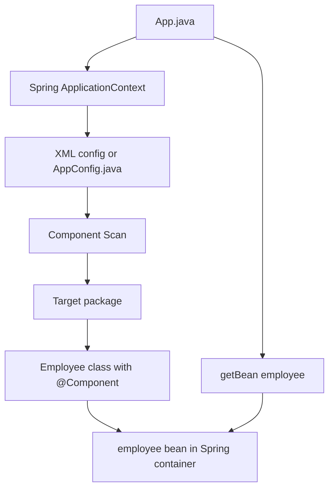

# Spring Annotation Notes

## What Are Annotations?

Annotations are special markers added to Java code using `@`.

They give extra instructions to Java, Spring, or other frameworks.

Example:

```java
@Component
public class Employee {
}
```

This tells Spring:

Treat `Employee` as a Spring bean.

Earlier, we created beans manually in XML:

```xml
<bean id="employee" class="com.example.componentscan.Employee"/>
```

With annotations, we can write:

```java
@Component
public class Employee {
}
```

Then Spring can automatically find the class during component scanning.

## Annotation Examples in This Project

You practiced annotations in these packages:

```text
src/main/java/com/example/componentscan
src/main/java/com/example/componentscanAnnotation/componentscan
src/main/java/com/example/autowired/annonation
```

Configuration files/classes:

```text
src/main/resources/componentScan.xml
src/main/java/com/example/componentscanAnnotation/componentscan/AppConfig.java
src/main/java/com/example/autowired/annonation/AppConfig.java
```

Important note:

The package name `annonation` is misspelled in the code, but it works because the package declaration and folder path match each other:

```java
package com.example.autowired.annonation;
```

Spring scans the same package:

```java
@ComponentScan(basePackages = "com.example.autowired.annonation")
```

So the spelling is technically wrong English, but correct for this project path.

## `@Component`

`@Component` tells Spring:

Create an object of this class and manage it as a bean.

Example from `com.example.componentscan.Employee`:

```java
@Component
public class Employee {
}
```

Spring creates a bean automatically.

Default bean name:

```text
employee
```

Spring takes the class name `Employee` and makes the first letter lowercase.

So this works:

```java
Employee employee = (Employee) applicationContext.getBean("employee");
```

### Custom Component Name

In `com.example.autowired.annonation.Employee`, you used:

```java
@Component("employee")
public class Employee {
}
```

This explicitly gives the bean the name:

```text
employee
```

This is useful when:

- You want a specific bean name
- You have multiple beans of similar type
- You want to use `@Qualifier`

## `@Value`

`@Value` injects simple values into fields.

Example:

```java
@Value("241241")
private int EmployeeId;

@Value("Sandeep")
private String FirstName;

@Value("Kumar")
private String LastName;
```

Spring sets these fields while creating the bean.

This is similar to XML property injection:

```xml
<property name="firstName" value="Sandeep"/>
```

But here, the value is written directly in Java code.

### SpEL With `@Value`

You also practiced this:

```java
@Value("#{4*4}")
private int Salary;
```

`#{4*4}` is a Spring Expression Language expression.

Spring evaluates it:

```text
4 * 4 = 16
```

So `Salary` becomes:

```text
16
```

## `@Configuration`

`@Configuration` tells Spring:

This class contains Spring configuration.

Example:

```java
@Configuration
public class AppConfig {
}
```

In this project, `AppConfig` replaces the XML configuration file for annotation-based examples.

Instead of:

```java
new ClassPathXmlApplicationContext("componentScan.xml")
```

you use:

```java
new AnnotationConfigApplicationContext(AppConfig.class)
```

## `@ComponentScan`

`@ComponentScan` tells Spring where to search for annotated classes.

Example:

```java
@ComponentScan(basePackages = "com.example.componentscanAnnotation.componentscan")
```

This tells Spring:

Look inside this package and find classes marked with annotations like `@Component`.

In this package, Spring finds:

```java
@Component
public class Employee {
}
```

Then Spring creates an `Employee` bean.

## XML Component Scan vs Java Annotation Component Scan

You practiced both styles.

### XML Component Scan

File:

```text
src/main/resources/componentScan.xml
```

Code:

```xml
<context:component-scan base-package="com.example.componentscan"/>
```

App starts Spring with XML:

```java
ApplicationContext applicationContext =
        new ClassPathXmlApplicationContext("componentScan.xml");
```

Flow:

```text
App.java
   |
   v
componentScan.xml
   |
   v
scan com.example.componentscan
   |
   v
find @Component Employee
   |
   v
create employee bean
```

### Java Annotation Component Scan

File:

```text
AppConfig.java
```

Code:

```java
@Configuration
@ComponentScan(basePackages = "com.example.componentscanAnnotation.componentscan")
public class AppConfig {
}
```

App starts Spring with Java config:

```java
ApplicationContext applicationContext =
        new AnnotationConfigApplicationContext(AppConfig.class);
```

Flow:

```text
App.java
   |
   v
AppConfig.class
   |
   v
@ComponentScan package
   |
   v
find @Component Employee
   |
   v
create employee bean
```

## Component Scan Architecture Diagram



## `@Autowired`

`@Autowired` tells Spring:

Automatically inject a matching bean here.

In `Manager.java`, you practiced field injection:

```java
@Autowired
@Qualifier("employee")
private Employee employee;
```

This means:

Spring should find an `Employee` bean and assign it to this field.

So internally, Spring does something like:

```java
manager.employee = employeeBean;
```

The `Manager` class does not manually create the employee:

```java
new Employee()
```

Spring injects it.

## `@Qualifier`

`@Qualifier` tells Spring which bean to inject when there are multiple options.

Example:

```java
@Autowired
@Qualifier("employee")
private Employee employee;
```

This means:

Find the bean named `employee` and inject it here.

This matches:

```java
@Component("employee")
public class Employee {
}
```

In small projects, `@Autowired` may be enough.

In bigger projects, there can be multiple beans of the same type. Then `@Qualifier` helps Spring choose the correct one.

## Annotation-Based Autowiring Flow

Package:

```text
com.example.autowired.annonation
```

Classes:

```text
App.java
AppConfig.java
Employee.java
Manager.java
```

Flow:

```text
App.java starts
   |
   v
AnnotationConfigApplicationContext(AppConfig.class)
   |
   v
AppConfig scans com.example.autowired.annonation
   |
   +--> finds Employee with @Component("employee")
   |
   +--> finds Manager with @Component
           |
           v
      sees @Autowired field
           |
           v
      sees @Qualifier("employee")
           |
           v
      injects employee bean into Manager
```

## Annotation Autowiring Diagram

```mermaid
flowchart TD
    App[App.java] --> JavaConfig[AppConfig.java]
    JavaConfig --> Scan[@ComponentScan]
    Scan --> EmployeeClass[Employee @Component employee]
    Scan --> ManagerClass[Manager @Component]
    EmployeeClass --> EmployeeBean[employee bean]
    ManagerClass --> ManagerBean[manager bean]
    ManagerBean --> Autowired[@Autowired field]
    Autowired --> Qualifier[@Qualifier employee]
    Qualifier --> EmployeeBean
    App --> GetManager[getBean manager]
    GetManager --> ManagerBean
```

## `@Override`

`@Override` is not a Spring annotation. It is a Java annotation.

You used it in methods like:

```java
@Override
public String toString() {
    return "Employee{...}";
}
```

It tells Java:

This method is overriding a method from a parent class or interface.

For `toString()`, the parent method comes from `Object`.

Benefit:

If you make a spelling mistake, Java can catch it.

Example mistake:

```java
public String tostring() {
}
```

This would not override `toString()` correctly. With `@Override`, Java reports an error.

## XML Bean vs Annotation Bean

XML style:

```xml
<bean id="employee" class="com.example.componentscan.Employee"/>
```

Annotation style:

```java
@Component
public class Employee {
}
```

Both create Spring beans.

Difference:

XML keeps bean definitions outside Java code.

Annotations keep bean definitions closer to the class itself.

## `ClassPathXmlApplicationContext` vs `AnnotationConfigApplicationContext`

Use this when loading XML:

```java
new ClassPathXmlApplicationContext("componentScan.xml")
```

Use this when loading Java config:

```java
new AnnotationConfigApplicationContext(AppConfig.class)
```

In this project:

`com.example.componentscan.App` uses XML:

```java
new ClassPathXmlApplicationContext("componentScan.xml")
```

`com.example.componentscanAnnotation.componentscan.App` uses Java config:

```java
new AnnotationConfigApplicationContext(AppConfig.class)
```

`com.example.autowired.annonation.App` also uses Java config:

```java
new AnnotationConfigApplicationContext(AppConfig.class)
```

## Important Mistake We Fixed Earlier

The component scan example failed with:

```text
Unsupported class file major version 69
```

That was not an annotation mistake.

It happened because:

- Java 25 creates class file major version 69
- Spring 6.1.6 could not scan that class format
- Component scanning reads `.class` files

The fix was to compile the project to Java 21 bytecode in `pom.xml`:

```xml
<maven.compiler.release>21</maven.compiler.release>
```

Then run:

```bash
mvn clean compile
```

This removed old Java 25 class files and rebuilt Java 21 class files.

## Expected Outputs

Run XML component scan:

```bash
mvn -q exec:java -Dexec.mainClass=com.example.componentscan.App
```

Expected output:

```text
Employee{EmployeeId=241241, FirstName='Sandeep', LastName='Kumar', Salary=16}
```

Run Java config component scan:

```bash
mvn -q exec:java -Dexec.mainClass=com.example.componentscanAnnotation.componentscan.App
```

Expected output:

```text
[Using Annotations instead of XML] Employee{EmployeeId=241241, FirstName='Sandeep', LastName='Kumar', Salary=16}
```

Run annotation autowiring:

```bash
mvn -q exec:java -Dexec.mainClass=com.example.autowired.annonation.App
```

Expected output includes:

```text
[Using Annotations instead of XML] Employee{EmployeeId=241241, FirstName='Lucky', LastName='Kumar', Salary=16}
Manager{employee=[Using Annotations instead of XML] Employee{EmployeeId=241241, FirstName='Lucky', LastName='Kumar', Salary=16}}
```

## Summary

Annotations reduce XML configuration.

In this project:

- `@Component` creates beans automatically
- `@Value` injects simple values
- `@Configuration` marks a Java config class
- `@ComponentScan` tells Spring which package to scan
- `@Autowired` injects dependencies automatically
- `@Qualifier` selects a specific bean by name
- `@Override` is a Java annotation used for method overriding

The main learning point:

Instead of defining every bean manually in XML, Spring can scan your code, find annotated classes, create beans, inject values, and connect dependencies automatically.

