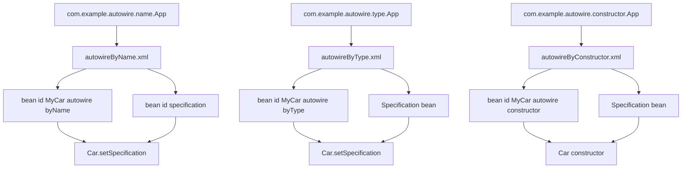

# Spring Autowiring Notes

## What Is Autowiring?

Autowiring means Spring automatically connects one bean with another bean.

In earlier XML examples, we manually told Spring what to inject:

```xml
<bean id="MyCar" class="car.example.constructor.injection.Car">
    <constructor-arg ref="CarSpecification"/>
</bean>
```

Here, we explicitly said:

Use `CarSpecification` when creating `MyCar`.

With autowiring, we reduce that manual wiring:

```xml
<bean id="MyCar" class="com.example.autowire.name.Car" autowire="byName">
</bean>
```

Now Spring decides how to connect the dependency based on the autowire mode.

## Autowiring Examples in This Project

The autowiring examples are inside:

```text
src/main/java/com/example/autowire
```

There are three packages:

```text
com.example.autowire
├── name
│   ├── App.java
│   ├── Car.java
│   └── Specification.java
├── type
│   ├── App.java
│   ├── Car.java
│   └── Specification.java
└── constructor
    ├── App.java
    ├── Car.java
    └── Specification.java
```

The XML files are:

```text
src/main/resources/autowireByName.xml
src/main/resources/autowireByType.xml
src/main/resources/autowireByConstructor.xml
```

## Common Object Model

All three examples use the same basic idea.

`Specification` holds car details:

```java
private String make;
private String model;
```

Spring sets these values from XML:

```xml
<property name="make" value="Toyota"/>
<property name="model" value="Corolla"/>
```

`Car` needs a `Specification` object:

```java
private Specification specification;
```

The difference between the examples is how Spring injects that `Specification` into `Car`.

## Autowire byName

### Main Rule

`autowire="byName"` matches the bean id with the Java property name.

In `Car.java`, the property is:

```java
private Specification specification;
```

The setter is:

```java
public void setSpecification(Specification specification) {
    this.specification = specification;
}
```

The property name is:

```text
specification
```

So the XML bean id must also be:

```xml
<bean id="specification" class="com.example.autowire.name.Specification">
```

Then the `Car` bean can use:

```xml
<bean id="MyCar" class="com.example.autowire.name.Car" autowire="byName">
</bean>
```

### How Spring Thinks

Spring sees:

```xml
autowire="byName"
```

Then Spring checks the `Car` class for a setter:

```java
setSpecification(...)
```

That setter means the property name is:

```text
specification
```

Then Spring searches for a bean with id:

```text
specification
```

It finds:

```xml
<bean id="specification" class="com.example.autowire.name.Specification">
```

Then Spring calls:

```java
car.setSpecification(specificationBean);
```

### byName Flow Diagram

```text
autowireByName.xml
        |
        +--> bean id="specification"
        |       |
        |       v
        |   Specification object
        |
        +--> bean id="MyCar" autowire="byName"
                |
                v
        Spring looks for setSpecification(...)
                |
                v
        property name = specification
                |
                v
        matches bean id="specification"
                |
                v
        calls car.setSpecification(specificationBean)
```

### Mistake We Fixed

The mistake was thinking that XML autowiring directly sets the private field:

```java
private Specification specification;
```

But `autowire="byName"` needs a setter method.

Correct:

```java
public void setSpecification(Specification specification) {
    this.specification = specification;
}
```

Without this setter, `specification` stays `null`, and this line fails:

```java
specification.toString()
```

That caused the earlier `NullPointerException`.

### Expected Debug Output

```text
[byName] Starting application
[byName] Loading Spring context from autowireByName.xml
[byName] Spring called setSpecification() because bean id matches property name
[byName] Requesting bean with id MyCar from Spring container
[byName] Calling displayDetails() on Car bean
[byName] Inside Car.displayDetails(), specification is ready
Car Details Specification{make='Toyota', model='Corolla'}
[byName] Application finished
```

Important point:

The setter log appears while Spring is loading the context because singleton beans are created during context startup.

## Autowire byType

### Main Rule

`autowire="byType"` matches using the Java type, not the bean id.

The `Car` class has:

```java
private Specification specification;
```

and:

```java
public void setSpecification(Specification specification) {
    this.specification = specification;
}
```

The setter parameter type is:

```text
Specification
```

So Spring searches for one bean of type:

```text
com.example.autowire.type.Specification
```

The XML has:

```xml
<bean id="specification" class="com.example.autowire.type.Specification">
    <property name="make" value="Toyota"/>
    <property name="model" value = "Corolla"/>
</bean>

<bean id = "MyCar" class="com.example.autowire.type.Car" autowire="byType">
</bean>
```

Here, the id `specification` is not the important part.

The important part is:

```xml
class="com.example.autowire.type.Specification"
```

### How Spring Thinks

Spring sees:

```xml
autowire="byType"
```

Then Spring checks `Car` for setter methods.

It finds:

```java
setSpecification(Specification specification)
```

Then Spring searches the container for a bean whose class matches `Specification`.

It finds:

```xml
<bean id="specification" class="com.example.autowire.type.Specification">
```

Then Spring calls:

```java
car.setSpecification(specificationBean);
```

### byType Flow Diagram

```text
autowireByType.xml
        |
        +--> bean id="specification"
        |       |
        |       v
        |   type = com.example.autowire.type.Specification
        |
        +--> bean id="MyCar" autowire="byType"
                |
                v
        Spring looks for setSpecification(Specification)
                |
                v
        required type = Specification
                |
                v
        finds one Specification bean
                |
                v
        calls car.setSpecification(specificationBean)
```

### Mistakes We Fixed

The XML originally had the wrong class packages:

```xml
class="car.example.setter.injection.Specification"
class="car.example.setter.injection.Car"
```

But the actual classes are:

```text
com.example.autowire.type.Specification
com.example.autowire.type.Car
```

So the XML needed to be:

```xml
<bean id="specification" class="com.example.autowire.type.Specification">
```

and:

```xml
<bean id = "MyCar" class="com.example.autowire.type.Car" autowire="byType">
```

The `Car` class also needed this setter:

```java
public void setSpecification(Specification specification) {
    this.specification = specification;
}
```

### Important byType Warning

`byType` works only when Spring finds exactly one matching bean type.

This is fine:

```xml
<bean id="specification" class="com.example.autowire.type.Specification"/>
```

This can cause confusion:

```xml
<bean id="specification1" class="com.example.autowire.type.Specification"/>
<bean id="specification2" class="com.example.autowire.type.Specification"/>
```

Now Spring sees two `Specification` beans. It may not know which one to inject.

### Expected Debug Output

```text
[byType] Starting application
[byType] Loading Spring context from autowireByType.xml
[byType] Spring called setSpecification() because it found one Specification bean type
[byType] Requesting bean with id MyCar from Spring container
[byType] Calling displayDetails() on Car bean
[byType] Inside Car.displayDetails(), specification is ready
Car Details Specification{make='Toyota', model='Corolla'}
[byType] Application finished
```

## Autowire constructor

### Main Rule

`autowire="constructor"` matches using the constructor parameter type.

The `Car` class has:

```java
public Car(Specification specification) {
    this.specification = specification;
}
```

The constructor needs:

```text
Specification
```

So Spring searches for a bean of type:

```text
com.example.autowire.constructor.Specification
```

The XML has:

```xml
<bean id="specification" class="com.example.autowire.constructor.Specification">
    <property name="make" value="Toyota"/>
    <property name="model" value = "Corolla"/>
</bean>

<bean id = "MyCar" class="com.example.autowire.constructor.Car" autowire="constructor">
</bean>
```

Spring finds the `Specification` bean and passes it into the constructor.

### How Spring Thinks

Spring sees:

```xml
autowire="constructor"
```

Then Spring checks the constructors of `Car`.

It finds:

```java
Car(Specification specification)
```

Then Spring searches for a bean of type `Specification`.

It finds:

```xml
<bean id="specification" class="com.example.autowire.constructor.Specification">
```

Then Spring creates the car like this:

```java
Car car = new Car(specificationBean);
```

### constructor Flow Diagram

```text
autowireByConstructor.xml
        |
        +--> bean id="specification"
        |       |
        |       v
        |   type = com.example.autowire.constructor.Specification
        |
        +--> bean id="MyCar" autowire="constructor"
                |
                v
        Spring looks for Car constructor
                |
                v
        finds Car(Specification specification)
                |
                v
        finds one Specification bean
                |
                v
        calls new Car(specificationBean)
```

### Mistakes We Fixed

The XML originally had the wrong class packages:

```xml
class="car.example.autowire.constructor.Specification"
class="car.example.autowire.constructor.Car"
```

But the real package is:

```text
com.example.autowire.constructor
```

So the XML needed:

```xml
class="com.example.autowire.constructor.Specification"
```

and:

```xml
class="com.example.autowire.constructor.Car"
```

The `Car` class also needed a matching constructor:

```java
public Car(Specification specification) {
    this.specification = specification;
}
```

Without that constructor, Spring cannot inject using constructor autowiring.

### Expected Debug Output

```text
[constructor] Starting application
[constructor] Loading Spring context from autowireByConstructor.xml
[constructor] Spring called Car(Specification) while creating the Car bean
[constructor] Requesting bean with id MyCar from Spring container
[constructor] Calling displayDetails() on Car bean
[constructor] Inside Car.displayDetails(), specification is ready
Car Details Specification{make='Toyota', model='Corolla'}
[constructor] Application finished
```

## Comparison Table

| Mode | How Spring Matches | Requires Setter? | Requires Constructor? | Main Risk |
| --- | --- | --- | --- | --- |
| `byName` | Bean id matches property name | Yes | No | Bean id and property name mismatch |
| `byType` | Bean class/type matches setter parameter type | Yes | No | Multiple beans of the same type |
| `constructor` | Bean class/type matches constructor parameter type | No | Yes | Missing constructor or ambiguous constructor |

## Full Architecture Diagram



## How to Run Each Example

Run byName:

```bash
mvn -q exec:java -Dexec.mainClass=com.example.autowire.name.App
```

Run byType:

```bash
mvn -q exec:java -Dexec.mainClass=com.example.autowire.type.App
```

Run constructor:

```bash
mvn -q exec:java -Dexec.mainClass=com.example.autowire.constructor.App
```

## Summary

Autowiring lets Spring automatically connect dependencies.

`byName`:

Spring matches the bean id with the Java property name.

`byType`:

Spring matches using the dependency type.

`constructor`:

Spring matches using the constructor parameter type.

In this project, all three examples create a `Car` bean and inject a `Specification` bean into it.

The final result for each example is:

```text
Car Details Specification{make='Toyota', model='Corolla'}
```

The debug print statements show exactly when Spring performs the injection.

